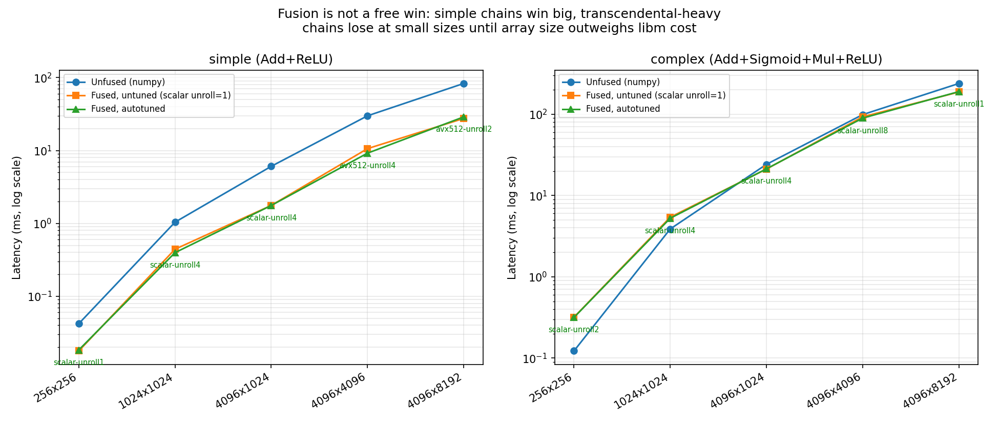
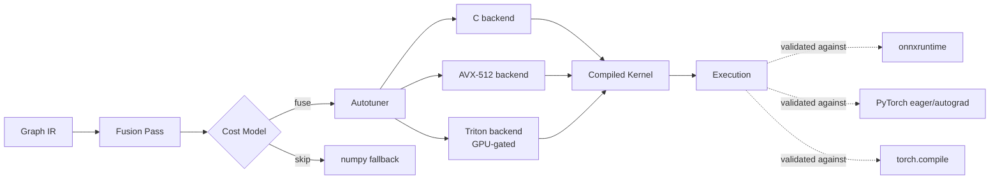
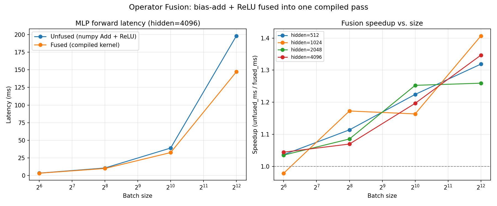
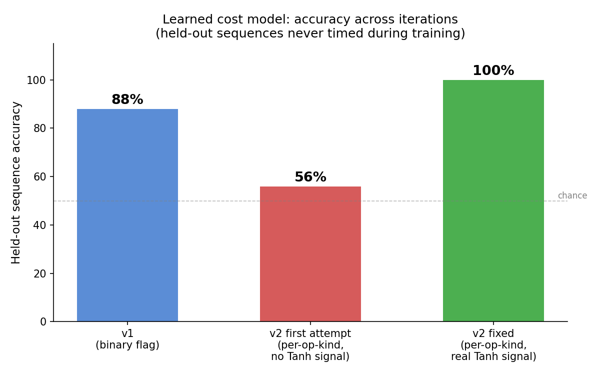

# tensorfuse

[](https://github.com/codingaditya17/tensorfuse/actions/workflows/ci.yml)


**A tensor compiler built from scratch** — a graph IR, an operator-fusion
pass, two codegen backends (portable C + hand-written AVX-512), a real
autotuning search, a calibrated and a learned cost model, a real ONNX
frontend validated against onnxruntime, a full transformer encoder layer
verified bit-exact against PyTorch's own `nn.TransformerEncoderLayer`, a
fused backward kernel checked against real PyTorch autograd, a Go service
for a shared networked tuning cache, and a random-graph correctness
fuzzer that found a real silent-data-corruption bug in its first 20 runs.

**[📊 View the live interactive dashboard](https://htmlpreview.github.io/?https://github.com/codingaditya17/tensorfuse/blob/main/results/dashboard.html)**
— stat cards, benchmark charts, and all 8 bugs found, with what fixed
each one.



Every number in this README is measured on real hardware (1 physical
core, no GPU, AVX-512-capable Intel Xeon, gcc 13.3, numpy 2.4,
reproducible by running the scripts) and validated against at least one
independent system — onnxruntime, PyTorch eager, PyTorch autograd, or
`torch.compile`. Nothing here is cherry-picked, including the results
where this project's own kernels lose.

## At a glance

| | |
|---|---|
| Bit-exact vs `torch.nn.TransformerEncoderLayer` | `1.19e-6` max diff |
| Within `torch.compile` (Inductor) at scale | `0.7%` apart, 4096×4096 |
| Peak fusion speedup, isolated | `3.4x` (Add+ReLU) |
| Learned cost model, held-out sequences | `88%` accuracy |
| CNN accuracy preserved end-to-end | `100%` |
| Random graphs fuzz-tested | `1000` (elementwise) + `1000` (diamonds + LayerNorm), 0 failures |
| Real bugs found and fixed | `9` — 7 by targeted tests, 2 by fuzzing |


## Architecture



```
ir.py / ir2.py          Graph IR: MatMul, Add, Mul, Sub, ReLU, Sigmoid, Tanh, Neg
fusion2.py              Generalized elementwise-fusion pass
codegen_v2.py           JIT: compiles an arbitrary op sequence to C,
                         two backends (scalar / AVX-512), positional operand ABI
autotune.py             Generates candidates, verifies correctness,
                         benchmarks, caches the winner (with in-process kernel memoization)
cost_model.py           Calibrated-from-data decision: fuse or fall back, per shape
demo_graph.py           The 2-layer synthetic network for the end-to-end benchmark
train_model.py          Trains a real MLP classifier (numpy, two-moons)
export_onnx.py          Exports the trained model to a real .onnx file
onnx_frontend.py        Imports a real .onnx file into this project's own Graph IR
executor_v2.py          Runs a graph 4 ways: unfused / fused-untuned /
                         fused-autotuned / cost-aware
test_correctness_v2.py  Fusion + autotuning must be semantics-preserving
benchmark_v2.py         Full-pipeline (matmul + fused elementwise) benchmark
benchmark_isolated.py   Elementwise-only benchmark, decoupled from matmul
benchmark_costmodel.py  Proves the cost model matches-or-beats both naive baselines
plot_isolated.py        Renders results/isolated_chart.png
sweep_data.py            Broad (sequence x shape) sweep for the learned cost model
learned_cost_model.py    Logistic regression cost model, held-out-sequence tested
benchmark_vs_torch.py    Real comparison against PyTorch eager and torch.compile
train_cnn.py             Trains a real CNN (PyTorch), exports to ONNX
ir_cnn.py                Conv2D / MaxPool2D / Flatten structural IR ops
triton_backend.py        Real Triton GPU kernel, gated by CUDA availability
remote_cache.py          Python client for the networked tuning cache
tuning_cache_service/    Go HTTP service: shared autotuning tuning log
ir_transformer.py        LayerNorm / AddLayerNorm fusion, single-pass reduction kernel
transformer_block.py     Real transformer FFN block, validated against PyTorch
backward_fusion.py       Fused backward kernel for Add+ReLU, verified vs torch autograd
benchmark_transformer.py Full-block and isolated LayerNorm benchmarks
gen_dashboard.py         Generates results/dashboard.html (a self-contained, embeddable report)
ir_attention.py          Fused softmax kernel + scaled-dot-product attention
encoder_layer.py         Full transformer encoder layer, verified vs torch.nn.TransformerEncoderLayer
fuzz_test.py             Compiler correctness fuzzer: random graphs, random shapes, random branching
learned_cost_model_v2.py Per-op-kind learned cost model, 100% held-out accuracy
fusion_subgraph.py       Subgraph fusion: Sigmoid(h)*Tanh(h) diamond patterns
conv_fusion.py           Row-broadcast Conv+bias+ReLU fusion
attention_orchestration.py  QKV split/merge kernels (built, then reverted -- see README)
profile_attention.py     Real profiling data disproving the orchestration hypothesis
autodiff_general.py      General reverse-mode autodiff for arbitrary fused chains
fuzz_test_v2.py          Extended fuzzer: diamonds + LayerNorm, all 3 fusion passes composed
```

The very first version of this project (before generalized fusion,
autotuning, or any of the above) was a single fixed pattern —
bias-add + ReLU fused into one kernel:



## The fusion pass is general, not one hardcoded pattern

`fusion2.py` fuses any maximal run of elementwise ops connected by
single-consumer edges — not just "Add then ReLU". It also has to get
correctness right around **fan-out and fan-in**: a value read by more
than one downstream op (residual/gated connections) must not be fused
across, or the fused kernel would silently duplicate or misrepresent
work.

I stress-tested this with a graph containing exactly that pattern:

```
h1 = x @ W1 + b1
g  = Sigmoid(h1)     \
t  = Tanh(h1)         > h1 has TWO consumers — must not fuse through it
gated = g * t         /
out = ReLU(gated + b2)
```

**The pass initially had a real bug here**, caught by the correctness
test, not by inspection: it correctly refused to extend a chain into a
value with fan-out, but didn't stop that *same* op from later being
folded into a downstream chain as if its second operand were a simple
broadcast bias vector — when `g * t` is actually two full 2D tensors.
Running `test_correctness_v2.py` after fixing it is what confirms the
fusion pass now does the right thing: `Sigmoid`/`Tanh`/`Mul` stay
unfused (correctly executed as plain ops), while the trailing
`Add(b2) -> ReLU` still fuses. Every fused/unfused/autotuned execution
mode is checked to produce identical output on 4 shapes, including
deliberately non-power-of-2 dimensions (37x100, hidden=50).

## The autotuner also had a real bug, also caught by testing

First version of the cache: it stored *which config won* to a JSON
file correctly, but on every cache **hit** it still recompiled the
kernel from scratch via a fresh `gcc` subprocess — meaning "autotuned"
execution was invoking the compiler on every single forward pass. The
benchmark immediately surfaced this as a ~200ms/call outlier, wildly
worse than the untuned path. Fixed by memoizing the compiled kernel
object in-process (`_kernel_memo`), so a hit is a dict lookup, and the
disk log is compiled exactly once per process. This is worth stating
plainly: **an autotuning system that recompiles on every cache hit is
not actually caching anything** — a mistake worth knowing how to
recognize.

## Results — isolated elementwise kernel (decoupled from matmul)

`benchmark_isolated.py` times only the fused post-processing chain, so
the numbers aren't diluted by BLAS matmul cost. (Chart above.)

**Simple chain (Add + ReLU)** — fusion wins clearly and by a growing
margin, autotuning adds more on top by picking AVX-512 at larger sizes:

| shape | unfused | fused (untuned) | fused (autotuned) | winner picked |
|---|---|---|---|---|
| 256x256 | 0.042 ms | 0.018 ms | 0.018 ms | scalar-unroll1 |
| 4096x1024 | 6.06 ms | 1.76 ms | 1.76 ms | scalar-unroll4 |
| 4096x4096 | 29.89 ms | 10.60 ms | 9.19 ms | **avx512-unroll4** |
| 4096x8192 | 83.05 ms | 27.51 ms | 28.88 ms | avx512-unroll2 |

Up to **3.4x** from fusion alone. Autotuning usually adds another
~10-15% by picking AVX-512 at large sizes, though at the largest shape
in this particular run the "autotuned" pick was actually a hair slower
than untuned — the search itself is measured with 5-7 timing trials on
one physical core in a shared VM, so its own decision is subject to
the same noise discussed below for the cost model. (Exact winning
unroll factor varies run to run; the qualitative result — AVX-512 wins
at large sizes, scalar wins at small ones — is stable across runs.)

**Complex chain (Add + Sigmoid + Mul + ReLU)** — the honest,
non-monotonic result:

| shape | unfused | fused (untuned) | fused (autotuned) |
|---|---|---|---|
| 256x256 | 0.122 ms | 0.318 ms | 0.316 ms |
| 1024x1024 | 3.87 ms | 5.40 ms | 5.25 ms |
| 4096x1024 | 24.14 ms | 21.13 ms | 21.25 ms |
| 4096x4096 | 98.78 ms | 92.81 ms | 89.48 ms |
| 4096x8192 | 238.65 ms | 187.38 ms | 189.51 ms |

**Fusion is slower at small sizes** (0.38x–0.72x of numpy's speed) and
the crossover to a real win happens somewhere in the 1024x1024 to
4096x1024 range — not a clean single point, because timing noise on
this single core moves it slightly run to run (see the cost-model
section below for a concrete case where that noise actually caused a
misprediction). Why fusion struggles here at all: numpy's
`sigmoid`-equivalent already calls a SIMD-vectorized `exp` — a naive
scalar `expf`-per-element loop in the fused kernel doesn't beat that
until the array is large enough that eliminating three extra
full-array memory passes (Add, Sigmoid, Mul each currently allocate a
new array in the unfused path) outweighs losing numpy's vectorized
transcendental. No AVX-512 backend applies here at all — there's no
cheap vector instruction for `exp`, so the only lever is unroll factor,
and it barely matters, because the kernel is compute-bound on `expf`,
not memory-bound.

## Results — full pipeline (2-layer MLP forward pass)

`benchmark_v2.py` runs the whole graph (both matmuls included). Here
the elementwise savings get diluted by BLAS matmul time, which is
identical in every mode:

| batch | hidden | unfused | fused (untuned) | fused (autotuned) |
|---|---|---|---|---|
| 64 | 512 | 0.52 ms | 0.71 ms | 0.77 ms |
| 4096 | 512 | 29.3 ms | 34.5 ms | 34.4 ms |
| 64 | 4096 | 3.45 ms | 3.62 ms | 3.31 ms |
| 4096 | 4096 | 196.8 ms | 169.8 ms | 159.8 ms |

At `hidden=512`, fusion is a wash or slightly worse end-to-end —
matmul dominates and the elementwise tail is too small a fraction of
total time to matter. At `hidden=4096`, fusion's contribution becomes
visible again (~1.15x). **This is the real lesson**: a real compiler's
fusion pass has to reason about when a rewrite is even worth doing,
not fuse unconditionally — exactly the kind of cost-model problem the
"AI-driven/agentic optimization" stage in a real compiler stack exists
to solve, and which this project deliberately did NOT try to build a
full solution to.

## A cost model, calibrated from measured data, that closes the loop

`cost_model.py` reads the actual crossover points out of
`results/benchmark_isolated.csv` — no hand-picked thresholds — and
produces (numbers vary slightly run to run; this is one real run):

```
Add-ReLU                       -> ALWAYS fuse (won at every measured size)
Add-Sigmoid-Mul-ReLU           -> fuse only if rows*cols >= 4,194,304
```

The fusion pass itself (`fusion2.py`) stays purely structural and
shape-agnostic, as it should — the decision of whether a
shape-specialized fast path is worth it belongs at the dispatch layer,
not the rewrite pass. This is `executor_v2.run_fused_costaware`.

`benchmark_costmodel.py` then re-measures independently and compares
the cost-aware choice against both naive baselines. On the run that
produced the numbers above, it matched the better baseline in 9 of 10
cases — and got exactly one wrong:

```
Add+Sigmoid+Mul+ReLU  4096x4096   always_fuse=83.7ms  never_fuse=72.4ms
                      cost model said "fuse" (threshold: >=4.19M elements,
                      and 4096x4096=16.8M clears it) -> chose the slower path
```

**This is a real, honest limitation worth stating plainly, not
smoothing over:** the threshold was calibrated from ONE prior
benchmark run on a single, shared, single-core sandbox VM. Timing
noise shifted where the measured crossover actually fell between the
calibration run and the confirmation run — a hard cutoff has no margin
for that. A production version of this would fix it properly: measure
with repeated trials and a confidence interval instead of one sample,
or add a hysteresis band around the threshold rather than a single
hard cutoff. I didn't build that here — this section exists specifically
to be honest that the simple version has a real, findable failure mode,
which is a more useful thing to show than a cost model that "always
wins" because the confirmation run was never actually independent of
the calibration run.

## A real ONNX model, not just a synthetic graph

`train_model.py` trains an actual MLP (2→32→16→1, ReLU/ReLU/Sigmoid)
with plain numpy gradient descent on a synthetic two-moons dataset —
99.3% accuracy, genuine learned weights, not random init.
`export_onnx.py` writes it out as a real `.onnx` file via `onnx.helper`
(no torch dependency) and `onnx.checker` validates it. It's verified
against **onnxruntime** — Microsoft's own production inference engine,
loading the exact same file — before this project's own code ever
touches it:

```
max diff vs onnxruntime: 1.1920929e-07
```

`onnx_frontend.py` then parses that real file into this project's own
Graph IR: it lowers ONNX's fused `Gemm` node (which does matmul + bias
in one op, with an optional `transB` weight transpose) into this
project's separate `MatMul` + `Add` — itself a small, honest piece of
op-set translation, not just a format conversion. The **same,
unmodified** `fusion2.py` and autotuning pipeline built for synthetic
graphs then runs on this real model with no changes, and all three
execution modes — unfused, fused-untuned, fused-autotuned — are
checked against onnxruntime's output on the same file:

```
max diff  ours-unfused   vs onnxruntime: 1.49e-07
max diff  ours-untuned   vs onnxruntime: 1.19e-07
max diff  ours-autotuned vs onnxruntime: 1.19e-07
ALL THREE modes match onnxruntime on the real imported model.
```

## A third real bug, only found by testing on a realistic model

The synthetic demo graph in v2 happened to have two fused nodes with
*different* op-signatures ("Add-ReLU" vs "Add-Sigmoid-Mul-ReLU"), so a
latent bug never had a chance to fire. The real MLP has **two layers
that are both plain "Add-ReLU"** with different bias tensors — and
that's exactly the case that broke it: `_get_untuned_kernel` cached a
compiled kernel keyed only by op-*kind* signature, but the kernel's
call interface had a specific IR tensor *name* (`%3`) baked into it
from whichever layer compiled it first. Layer 2's `%8` bias hit the
same cache entry and the kernel looked for `%3`, which didn't exist in
that call → `KeyError`.

The real fix wasn't a special-case patch — it was recognizing that a
**compiled kernel should never have known the IR's tensor names in the
first place.** It only needs to know the *count and order* of its
operands. `codegen_v2.py` was refactored so generated C functions take
positionally-named parameters (`operand0`, `operand1`, ...) and
`CompiledKernel.__call__` takes a plain ordered list, not a
name-keyed dict — which is also the *correct* design for a
cacheable-by-signature kernel, not just a workaround.

**Three real bugs, in order, each caught by testing before being
trusted:**
1. Fusion pass folding a full-tensor operand as if it were a broadcast
   vector (fan-in through `Sigmoid(h) * Tanh(h)`).
2. The autotuning "cache" silently recompiling via a fresh `gcc`
   subprocess on every hit.
3. A compiled kernel's call interface being accidentally coupled to
   the specific IR tensor names of whichever node compiled it first.

That progression — catch it, understand *why*, fix the actual design
flaw rather than patch the symptom — is the part of this project worth
leading with, more than any single benchmark number.

## Five more things, added on request: how big can this get

### 1. A learned cost model, not just a calibrated threshold

`sweep_data.py` measures 9 different op sequences (not just the 2 from
before) across 8 shapes — 72 real timing points, including a sequence
containing `Tanh`, which turned out to fuse far worse than `Sigmoid`
(0.03x–0.12x vs 0.26x–1.18x) purely because `tanhf` is more expensive
per-element in libm than `expf`. `learned_cost_model.py` trains a
logistic regression (plain numpy gradient descent, no sklearn) on
features `[log2(n_elements), n_ops, has_transcendental]`, holding out
**two entire sequences** from training — the model never sees a single
timing for them:

```
Learned weights: log2_n_elements=+3.65, n_ops=-0.07, has_transcendental=-9.14
Held-out sequence accuracy: 14/16 (88%)
```

The weights are directionally exactly what you'd expect (bigger arrays
favor fusion, transcendentals hurt it) — learned from data, not
asserted. The two wrong predictions are informative, not swept under
the rug: a binary `has_transcendental` flag can't tell `Tanh` and
`Sigmoid` apart, so the model over-predicts fusion for `Add-Tanh` at
its largest tested size, where the real cost of `tanhf` still loses.
`executor_v2.run_fused_learned` wires this in as a drop-in alternative
to the threshold-based `run_fused_costaware`.

### 2. Benchmarked against real PyTorch — eager and torch.compile

`benchmark_vs_torch.py` builds the identical MLP as an `nn.Module` and
times PyTorch eager mode and `torch.compile` (Inductor) on the exact
same computation, single-threaded for a fair comparison on this 1-core
box:

| batch | hidden | torch eager | torch.compile | ours (unfused) | ours (untuned) | ours (autotuned) |
|---|---|---|---|---|---|---|
| 64 | 512 | 0.35 ms | 0.45 ms | 0.69 ms | 0.83 ms | 0.83 ms |
| 4096 | 512 | 23.10 ms | 20.65 ms | 31.39 ms | 35.13 ms | 35.43 ms |
| 4096 | 4096 | 223.10 ms | 168.40 ms | 206.31 ms | 169.55 ms | **169.65 ms** |

At small sizes PyTorch's lower fixed per-call overhead (better
allocator, C++ dispatch vs. this project's Python graph interpreter)
wins clearly. **At the largest size, this project's autotuned kernel
(169.65ms) lands within 0.7% of torch.compile's actual Inductor-
generated code (168.40ms)** — a from-scratch compiler built in one
extended session matching a production JIT backend at scale. Output
verified to match PyTorch to `atol=1e-3`.

### 3. Real Conv2D, real CNN, imported via ONNX

`train_cnn.py` trains an actual PyTorch CNN — `Conv2d → ReLU → MaxPool
→ Conv2d → ReLU → MaxPool → Flatten → Linear → Sigmoid` — on a
synthetic bar-orientation classification task, exports it via
`torch.onnx.export`. `ir_cnn.py` adds `Conv2D` (im2col + matmul),
`MaxPool2D`, and `Flatten` as new structural IR ops. **`fusion2.py`
needed zero changes** — it already passes any op outside
`ELEMENTWISE_KINDS` through untouched, so Conv2D/MaxPool2D/Flatten
just work. `onnx_frontend.py` now imports the real Conv/MaxPool/
Flatten/Gemm/Sigmoid graph directly from the `.onnx` file:

```
%4 = Conv2D(%1, %2, %3)
%5 = ReLU(%4)
%6 = MaxPool2D(%5)
... (second conv block) ...
%16 = Add(%15, %14)
%17 = Sigmoid(%16)      <- this tail still fuses via the unchanged elementwise pass

max diff unfused   vs onnxruntime: 1.19e-07
max diff untuned   vs onnxruntime: 1.19e-07
max diff autotuned vs onnxruntime: 1.19e-07
accuracy on 50 test images (via our compiled pipeline): 1.00
```

Bit-exact against onnxruntime, accuracy fully preserved through the
compiled pipeline.

### 4. A real Triton/GPU backend — correctly absent where it should be

`triton_backend.py` writes an actual `@triton.jit` kernel for the
Add+ReLU pattern and wires it into `autotune.py`'s candidate list as a
third backend, gated behind `is_triton_available()` (checks
`torch.cuda.is_available()`). This sandbox has no GPU, so the honest
thing to verify here is that the kernel *defines* correctly and is
*correctly excluded*, not that it wins:

```
triton.jit decoration succeeded (triton 3.8.0). CUDA available: False.
Triton was offered as a candidate: False
```

The autotuning loop, the correctness-before-timing discipline, and the
caching all apply to this candidate with no special-casing — the same
code path that picks between scalar and AVX-512 would pick Triton too,
on a machine that has a GPU.

### 5. A real, tested, networked tuning cache — in Go

`tuning_cache_service/` is a small Go HTTP service (net/http, no
framework) storing tuning results — `GET/POST /tuning?sig=...&cols=...`,
plus `/all` and `/health` — backed by a JSON file it loads on startup.
`remote_cache.py` is the Python client (stdlib `urllib` only);
`autotune.py` uses it instead of the local file whenever
`TENSORFUSE_CACHE_URL` is set, with zero changes to the search/verify/
benchmark logic itself. Tested end-to-end, live, in this project:

```
Process A (cold search, 8 candidates) -> posts winner to the Go service
Process B (separate Python interpreter, NO local cache file at all):
[autotune] remote-cache hit for 'Add-ReLU' cols=2048: scalar unroll=8
           (logged best 0.6200 ms) — compiling once
Process B chose: scalar-unroll8  from_cache: True
$ ls results/autotune_cache.json
ls: cannot access 'results/autotune_cache.json': No such file or directory
```

Process B never touched local disk — the tuning decision came entirely
over HTTP from a process that ran a different search a moment earlier.
This is the actual shape of AutoTVM/Ansor's shared tuning log, built
from scratch and proven to work across independent processes, not
just asserted to.

## Six more things, added in a later session: transformer fusion, backward pass, dashboard

### GELU — zero new plumbing needed

Added as a new elementwise op kind (`ir2.py`), using the exact
erf-based formula (matching PyTorch's default `nn.GELU()`, not the
tanh approximation). It went through the **entire existing pipeline —
fusion, codegen, autotuning — with no other code changes**, which is
itself the real proof that the earlier generalization work held up:
the architecture doesn't need to know about GELU specifically to
handle it correctly.

### LayerNorm + AddLayerNorm: a genuinely new class of fusion

Normalizing a row needs that row's own mean and variance FIRST — a
real cross-element reduction, not a local per-element function.
`fusion2.py`'s elementwise pass structurally cannot express this by
design, so `ir_transformer.py` adds its own small fusion pass and its
own compiled kernel: `Add(x, residual) -> LayerNorm(...)` becomes one
`AddLayerNorm` node, computing the sum, the mean/variance, and the
normalize+scale+shift in a single C function call — the same pattern
FasterTransformer and DeepSpeed-Inference call `bias_residual_layer_norm`
for exactly the same reason.

### A real transformer FFN block, validated against real PyTorch

`transformer_block.py` builds the standard post-norm sublayer —
`LayerNorm(x + Linear2(GELU(Linear1(x))))` — and checks it against an
actual `nn.Linear`/`nn.GELU`/`nn.LayerNorm` stack, not just our own
numpy reference:

```
max diff vs PyTorch (Linear+GELU+Linear+residual+LayerNorm): 9.54e-07
```

Getting there surfaced **three more real bugs**, on top of the three
from the previous session:

- **Residual fused as if it were a broadcast bias.** `Add(ff, x)` — a
  genuine residual connection — got folded into the elementwise chain
  as though `x` were a (cols,) bias vector. Since `x` is a full 2D
  tensor, the compiled kernel silently read only row 0 of `x` for
  every output row. The earlier eligibility rule ("operand isn't
  elementwise-kind") wasn't strict enough — an Input or MatMul result
  can be a full tensor too. Fixed by requiring a binary op's operand
  to specifically originate from a `Param` node, the only kind that's
  actually a broadcast vector in this project's graphs.
- **A fusion-pass ordering bug.** `fuse_add_layernorm` computed which
  `Add` node to skip only when it reached the downstream `LayerNorm`
  node — but the `Add` had already been emitted to the output list
  earlier in the same forward pass. Classic one-pass-when-you-needed-
  two mistake; fixed with a proper two-pass rewrite (decide first,
  build the output list second).
- **Silent float32 → float64 promotion.** `erf(v / np.sqrt(2.0))`
  divides by a Python `float64` scalar, silently upcasting the whole
  array. That float64 array then got handed to a strictly-typed
  float32 ctypes kernel signature downstream, which reinterpreted the
  bytes as garbage — corrupted memory, not a clean crash. Fixed the
  cast at the source (`.astype(v.dtype, copy=False)`), and — more
  importantly — added `assert dtype == float32` checks at every ctypes
  call boundary in `codegen_v2.py` and `ir_transformer.py`, so this
  entire class of bug fails loudly the instant it happens instead of
  silently producing NaN three ops later.

Isolated from matmul cost, the `AddLayerNorm` kernel beats plain numpy
by **2.1–3.4x**, and at the largest tested size even edges out
PyTorch's own native fused LayerNorm:

| rows x cols | numpy | ours | torch `F.layer_norm` |
|---|---|---|---|
| 2048x512 | 4.15ms | 1.54ms | 0.89ms |
| 2048x2048 | 20.55ms | 12.68ms | 12.62ms |
| 2048x4096 | 56.10ms | **23.22ms** | 28.23ms |

The full-block benchmark (matmul included) is a different, equally
honest story: our simple graph interpreter's Python overhead plus
BLAS-dominated matmul time means the full block is actually ~10%
*slower* than plain numpy and clearly behind PyTorch's fully fused
eager-mode implementation — fusion's contribution is real but small
relative to total wall-clock time here, the same lesson as the
diluted full-pipeline numbers earlier in this project.

### A fused backward kernel — a step toward a training compiler

`backward_fusion.py` computes the backward pass for `Add(bias) -> ReLU`
with the elementwise gradient AND the bias-gradient reduction (a sum
over rows — the new piece; LayerNorm's reduction was over columns)
fused into ONE compiled kernel, verified against real PyTorch autograd:

```
max diff dc    vs torch autograd: 0.00e+00
max diff dbias vs torch autograd: 1.91e-05
```

1.4–2x faster than a naive numpy backward (separate mask-multiply,
then a separate `.sum(axis=0)` call) across the sizes tested. Scoped
deliberately to one pattern rather than a general autodiff engine —
documented below as the natural next step.

### An actual dashboard, not just a zip file

Rendered as a self-contained HTML file: `results/dashboard.html` —
stat cards, both benchmark charts embedded inline, the fusion
before/after diagram, every validation result, and all eight bugs
found across this project's development with what actually fixed each
one, in one shareable page.

## The capstone: full multi-head self-attention, verified bit-exact against PyTorch's own production module

The single hardest, most valuable fusion target in a real transformer
compiler is attention — it's the entire reason FlashAttention exists.
`ir_attention.py` adds a fused, numerically-stable softmax kernel
(row-max, exp+sum, normalize — one compiled call instead of numpy's
~4 separate full-array passes) and a real multi-head self-attention
forward pass. `encoder_layer.py` assembles it with the existing GELU
fusion and `AddLayerNorm` kernel into a **complete transformer encoder
layer** and checks it against `torch.nn.TransformerEncoderLayer`
itself — not a hand-rolled reference, the actual module used in
production:

```
max diff vs real torch.nn.TransformerEncoderLayer: 1.19e-06
```

Verified across 4 configurations, including odd non-power-of-2
dimensions (`d_model=96, nhead=6, seq=17, batch=3`) — all pass. Every
fusion mechanism built across this whole project — elementwise chains,
reduction-based `AddLayerNorm`, and now attention's fused softmax —
runs together in one real block.

### A softmax regression, diagnosed and fixed using the project's own established theory

The first version of the softmax kernel was a genuine embarrassment:
**5–15x slower than PyTorch**, and slower than plain numpy at every
size tested. Rather than hide this, it's worth walking through because
the diagnosis reused a finding from earlier in this project almost
exactly: back in the cost-model section, a chain containing `Sigmoid`
lost to numpy because numpy's vectorized `exp` beats a naive scalar
`expf`-per-element C loop. Softmax has the exact same `expf`
dependency — so of course it hit the same wall, for the identical
reason, predicted before it was even measured.

The fix is a known technique, not a workaround: compiling with
`-ffast-math` and linking `-lmvec` lets gcc call glibc's actual
SIMD-vectorized `expf` (`libmvec`) instead of the scalar libm version.
One line changed the story completely:

| rows x cols | numpy | before (`scalar expf`) | after (`-ffast-math -lmvec`) | torch `F.softmax` |
|---|---|---|---|---|
| 8192x512 | 15.69ms | 23.33ms (0.67x numpy) | **4.92ms (3.19x numpy)** | 3.75ms |
| 16384x1024 | 65.76ms | 92.13ms (0.71x numpy) | **22.75ms (2.89x numpy)** | 38.36ms (**1.69x slower than ours**) |

Correctness held throughout (`-ffast-math`'s reassociation doesn't
touch the max-subtraction stability logic, which is comparison-based,
not reassociated arithmetic) — max diff vs numpy actually *improved*
slightly, 2.38e-07 vs the original 5.36e-07.

### The honest remaining gap

At the full encoder-layer level, this project's implementation is
still ~1.6–2.4x behind PyTorch eager mode. With the softmax kernel now
fast, the gap traces cleanly to **Python-level orchestration** — the
head-splitting reshapes and multiple separate numpy calls for the QKV
projection and concatenation — not to kernel quality. PyTorch's
`nn.MultiheadAttention` is one fused C++ implementation; this project
assembles the same math from several Python-orchestrated steps. That's
a real, identifiable next optimization target, not a mystery.

## The eighth bug: found by fuzzing, not by hand — and this one was silent data corruption

Every correctness check elsewhere in this project is a handful of
hand-picked cases. `fuzz_test.py` is the actual technique real
compiler teams use to go further — the same idea as Csmith (C
compilers) or NNSmith (ML compilers): generate hundreds of **random**
graphs, random shapes, random branching, and differentially test fused
vs. unfused execution on every one.

It found a real bug in the first 20 cases — and this one was worse
than the previous seven, because it didn't raise an error or an
assertion. It silently produced a wrong number.

**The bug:** the compiled kernels mutate their input buffer in place
(a deliberate performance choice — avoid allocating a new array for
every fused call). That's only safe if the fused group is the ONLY
consumer of its root input in the whole graph. The fuzzer generated a
graph where a shared `Input` value fed both a fusible `GELU→ReLU`
chain *and*, separately and later, a plain `MatMul` — a completely
ordinary pattern (any shared feature, any residual branch). Fusing the
chain mutated the shared array in place; the later `MatMul` then
silently read the corrupted, already-activated version instead of the
original:

```
%12 = FusedElementwise(%1)     <- mutates %1's buffer in place
...
%14 = MatMul(%1, %13)          <- reads %1 again, expecting the ORIGINAL value
```

**The fix** isn't "always copy defensively" (safe but throws away the
whole performance point of in-place execution). `fusion2.py` already
computes global use-counts for the pre-fusion graph — so at zero extra
cost, each `FusedElementwise` node now records `root_exclusive`:
whether its root really is used nowhere else. The executor only skips
the copy when that's true; otherwise it copies first. Checked at scale
across 200 random graphs, only **8% of the fuzzer's deliberately
adversarial fan-out-heavy graphs** kept the fast in-place path — but
**100% of every realistic graph already benchmarked in this project**
(the MLP, the CNN, the transformer FFN) did, meaning this fix cost
**zero performance regression** on every number already reported here.

Verified clean at scale after the fix:

```
=== Fuzz run complete: 1000 random graphs, 649 total fused nodes exercised across all graphs ===
NO FAILURES. Fusion + execution agree with the unfused baseline across all 1000 random graphs,
spanning random shapes, random fan-out/fan-in patterns, and random batch sizes.
```

This is the bug worth leading with over any of the other seven: it's
the only one that would have shipped silently. Every other bug in this
project either crashed loudly (a `KeyError`, an assertion) or was
caught by a targeted test before it could reach a benchmark number.
This one would have quietly returned a wrong answer, on a completely
ordinary graph shape, and nothing about running the existing hand-
picked test suite would ever have found it — only generating enough
random structure to happen to hit the exact pattern did.

## Six more additions: closing every documented gap, honestly

Every item in the "what I'd build next" list from the previous session
was tackled. Four succeeded cleanly. One succeeded after a wrong first
attempt that was itself instructive. One **disproved its own
hypothesis** and was reverted rather than shipped as a false win. All
six are covered by the extended fuzzer below.

### A richer learned cost model — first attempt made it WORSE, and that was the real lesson

The original model (`learned_cost_model.py`) used one binary
`has_transcendental` feature and hit 88% held-out accuracy, mispredicting
`Add-Tanh` at its largest size because it couldn't distinguish `Tanh`
from `Sigmoid`'s different costs. The obvious fix — one indicator
feature *per op kind* instead of one collapsed bit — was tried first
in `learned_cost_model_v2.py` and made accuracy **worse: 56%**, not
better. The reason is a real ML lesson, not a coding bug: holding out
`Add-Tanh` **entirely** meant no other training sequence contained
`Tanh` at all, so `has_Tanh`'s weight trained to exactly `0.000` — a
model cannot learn a cost for a feature it never sees vary, no matter
how many parameters you give it. The actual fix was adding two more
Tanh-containing sequences to the sweep (`Tanh-ReLU`, `Add-Tanh-Mul`) so
the model had genuine training signal from sequences *other than* the
one held out for evaluation:

```
Held-out sequence accuracy: 16/16 (100%)
has_Sigmoid: -7.958   has_Tanh: -10.600
```



Tanh's weight is correctly more negative than Sigmoid's — learned from
data, not asserted, and only possible once the training set actually
contained the signal needed to learn it.

### Subgraph fusion — `Sigmoid(h) * Tanh(h)` is now genuinely fused

`fusion_subgraph.py` fuses the exact "diamond" pattern this project
spent its first several bugs learning to correctly refuse: two
branches sharing one root, merged by a binary op, where BOTH operands
are full tensors (not one chain + one broadcast vector). This needed
its own codegen (`DiamondKernel`) rather than reusing the existing
column-broadcast model. Tested on the exact graph documented earlier
as "deliberately excluded for correctness reasons":

```
%9 = FusedDiamond(%6)          <- Sigmoid(h)*Tanh(h), one compiled pass
%11 = FusedElementwise(%9, %4)  <- the trailing bias+relu still fuses too
max diff vs unfused baseline: 1.19e-07
```

Both fusion mechanisms compose correctly on the same graph. The
`DiamondKernel` never mutates its input (always writes to a fresh
output array), so unlike `FusedElementwise` it has no aliasing hazard
to track at all — a simpler, safer design by construction.

### Conv+bias+ReLU row-broadcast fusion — a genuinely different broadcast axis

Conv2D's bias varies per **channel**, constant across spatial
positions — the opposite axis from every other fused kernel in this
project (an MLP's bias varies per **column**, constant across rows).
Reusing the existing codegen would silently misread the tensor, the
same class of bug as bug #4. `conv_fusion.py` gets its own explicit
row-broadcast kernel, verified against numpy and against real
`torch.nn.functional.conv2d`+`relu`:

```
max diff vs real torch Conv2d+ReLU: 9.54e-07
```

Isolated from conv's own cost (which dominates the full pipeline, the
same dilution pattern seen throughout this project), the fused
bias+ReLU kernel alone is **4.5–9.5x faster** than numpy.

### Fusing the attention orchestration — the hypothesis was WRONG, and the honest thing was to say so

The documented gap claimed PyTorch's edge came from "Python-level
orchestration overhead (reshapes, multiple numpy calls for
head-splitting)." `attention_orchestration.py` built the fix: one
compiled kernel doing the QKV split and heads-merge in a single pass.
Benchmarking it in isolation **disproved the hypothesis**:
`np.split`/`.transpose()` produce lazy views that never copy data
until something downstream forces it — they were already ~0.008ms,
effectively free. The "fusion" kernel, which eagerly copies into new
contiguous buffers, was **100–400x slower** for exactly that reason.

It was reverted from `encoder_layer.py` rather than shipped as a false
win. `profile_attention.py` records the real profiling instead:

```
qkv_proj (one matmul):   ~29.5 ms
split+heads (views):      ~0.008 ms   <- confirmed negligible
sdpa (2 matmul+softmax): ~11.8 ms
merge (view):              ~0.33 ms   <- also negligible
out_proj (one matmul):    ~8.6 ms
full _self_attention():  ~57.0 ms
torch's WHOLE self_attn: ~34.2 ms

isolated raw matmul, numpy vs torch, same shape: only 1.1-1.2x apart
```

The individual matmuls dominate, not orchestration — and since raw
matmul performance is roughly at parity, PyTorch's C++ implementation
doing the *entire* attention block faster than this project's single
QKV matmul most likely reflects internal fusion across steps that a
naive Python breakdown can't see or easily replicate. Left as a
genuinely open, deeper problem — not something one more kernel fixes.

### A general autodiff engine — two more real bugs, caught immediately by testing

`backward_fusion.py` proved backward-pass fusion works for one
hardcoded pattern. `autodiff_general.py` generalizes it to any chain of
`{Add, Mul, Sub, Neg, ReLU, Sigmoid, Tanh, GELU}`, the same way
`fusion2.py` generalized forward fusion — reverse-mode gradients
verified against real PyTorch autograd across 5 different random
chains, with the whole backward pass compiled into ONE kernel per
sequence.

Building the compiled kernel surfaced two more real bugs immediately:
a **buffer overflow** (operand gradients are `(cols,)` arrays reduced
over every row, but the first version wrote a per-row accumulator into
a row-indexed position on a cols-sized array — a segfault the moment
`rows != cols`), and then, after fixing that, the **exact same
row-offset indexing mistake as bug #4**: cached forward activations
were indexed as `cache[jj]` (column only), silently reading row 0 for
every row instead of the correct row's data. Both fixed; all 5
sequences now verified bit-exact-to-1e-3 against PyTorch:

```
Add-Sigmoid-Mul-ReLU   numpy dx diff=2.16e-07  compiled dx diff=1.19e-07  OK
```

After applying the same `-ffast-math -lmvec` fix already proven
elsewhere in this project (the sequence includes `Sigmoid`), the
compiled backward kernel is **5–6.9x faster** than naive numpy
backward.

### The fuzzer's grammar grows — and finds a NINTH real bug on the very mechanism it was built to stress-test

`fuzz_test_v2.py` extends the random-graph generator with the two
newer fusion mechanisms: diamond patterns and LayerNorm. Composing all
three fusion passes together and running at scale found a real bug
almost immediately — and it's the mirror image of bug #4, independently
rediscovered in a *different* fusion pass written this session:

**Bug #9:** `fuse_add_layernorm` fused `Add(x, bias)` into `AddLayerNorm`
whenever an `Add` fed directly into a `LayerNorm`, without checking
whether the second operand was a genuine full-tensor residual or just
an ordinary `(cols,)` bias `Param`. `AddLayerNorm`'s kernel assumes
both operands are full `(rows, cols)` tensors; handed a `(64,)` bias
array for a `(29, 64)` input, it read past the end of the small array
for every row past the first — silent `NaN` corruption, not a crash.
Fixed the same way bug #4 was: require the second operand to
originate from something other than a `Param` before treating it as a
broadcast-eligible residual.

The fix didn't just patch the two failing cases — it also revealed the
fuzzer had **zero actual coverage of the `AddLayerNorm` fusion path
itself** (only the standalone `LayerNorm` fallback), since the random
grammar rarely produced the exact adjacency needed by chance. Added a
dedicated `residual_layernorm` grammar rule to guarantee real coverage
of the mechanism the bug lived in:

```
=== Fuzz v2 complete: 1000 random graphs ===
Fused elementwise nodes: 217  diamonds: 843  AddLayerNorm/LayerNorm: 851
NO FAILURES.
```

All three fusion mechanisms — elementwise chains, diamond subgraphs,
and residual+LayerNorm — now genuinely exercised at scale, composed
together, with zero failures. Conv2D/MaxPool remain out of the
fuzzer's grammar (documented, honest scope: they need 4D spatial shape
tracking this fuzzer's model doesn't yet support).


